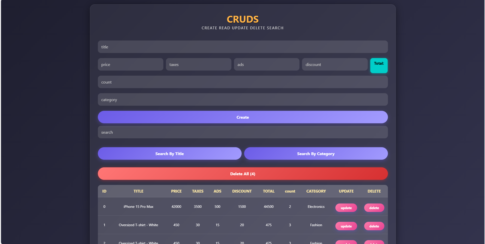

# 📊 Product Management - CRUD App

تطبيق ويب بسيط باستخدام JavaScript لإدارة المنتجات.  
يدعم إنشاء، عرض، تعديل، حذف، والبحث في المنتجات باستخدام **LocalStorage**.  
الواجهة أنيقة ومتجاوبة بالكامل بدون أي مكتبات خارجية.

---

## 🌐 رابط المشروع 

[🔗 جرّب التطبيق الآن](https://antonious-sameh.github.io/crud-product-management-app/)

---

## 🖼️ صورة من المشروع

---

## 🛠️ التقنيات المستخدمة

- ✅ HTML5
- ✅ CSS3 ( Responsive تصميم عصري )
- ✅ JavaScript ( LocalStorage مع)
